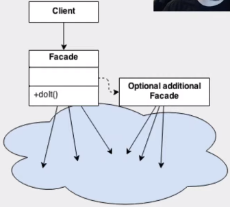
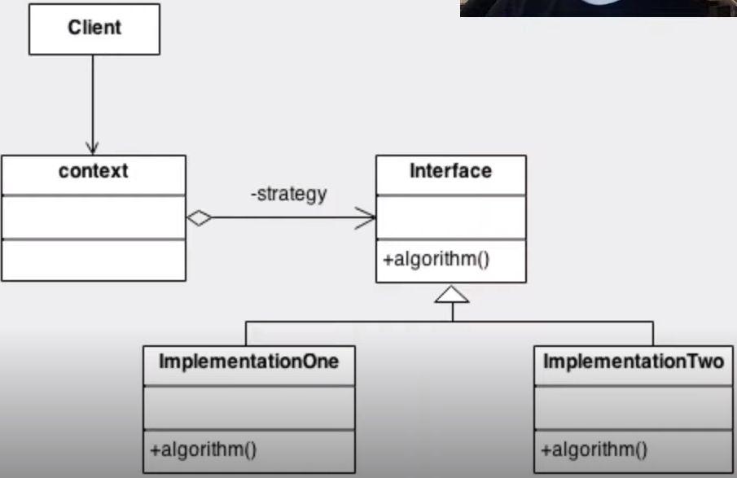

# Padrões de Projeto

### Definição

* São soluções consolidadas para problemas recorrentes no desenvolvimento e manutenção de software orientado a objetos

### Classificações

* **Padrões criacionais**

  * Abstract factory

  * Builder

  * Factory method

  * Prototype

  * Singleton

* **Padrões comportamentais**

  * Chain of responsibility

  * Iterator

  * Observer

  * Strategy

  * Template method

* **Padrões estruturais**

  * Adapter

  * Bridge

  * Composite

  * Decorator

  * Facade

  * Flyweight

  * Proxy

### Facade

* **Definição**: prover uma interface que reduza a complexidade nas integrações com subsistemas

* **Representação**

  

### Strategy

* **Definição**: simplificar a variação de algoritmos para a resolução de um mesmo problema

* **Representação**

  

* **Vantagem**: possibilita a implementação de diferentes comportamentos por causa da utilização de polimorfismo

* **Exemplo de implementação**

  * **Contexto** (Robot)

    ```java
    public class Robot {

      private Behavior behavior;

      public void setBehavior(Behavior behavior) {
          this.behavior = behavior;
      }

      public void move() {
          behavior.move();
      }

    }
    ```

  * **Estratégia** (Behavior)

    ```java
    public interface Behavior {

      void move();

    }
    ```

  * **Implementações da estratégia**

    * `AggressiveBehavior`

      ```java
      public class AggressiveBehavior implements Behavior {

        @Override
        public void move() {
          System.out.println("Movendo-se agressivamente...");
        }

      }
      ```

    * `DefensiveBehavior`

      ```java
      public class DefensiveBehavior implements Behavior {

        @Override
        public void move() {
          System.out.println("Movendo-se defensivamente...");
        }

      }
      ```

    * `NormalBehavior`

      ```java
      public class NormalBehavior implements Behavior {

        @Override
        public void move() {
          System.out.println("Movendo-se normalmente...");
        }

      }
      ```

### Singleton

* **Definição**: permitir a criação de uma única instância de uma classe e fornecer um modo para recuperá-la

* **Representação**

  

* **"Receita" de implementar**

  * Definir um campo (privado e estático) para armazenar uma instância da classe

  * Tornar o construtor privado para inviabilizar a instanciação de novos objetos

  * Criar um método (estático) para retornar a instância da classe

* **Formas de implementações**

  * **Singleton "tardio"**

    * **Definição**: a instanciação da classe será feita apenas quando o método `getInstance` for chamado

    * **Exemplo**

      ```java
      public class LazySingleton {
          
        private static LazySingleton instance;

        private LazySingleton() {}

        public static LazySingleton getInstance() {
          if (instance == null) {
              instance = new LazySingleton();
          }

          return instance;
        }

      }
      ```

  * **Singleton "ansioso"**

    * **Definição**: a instanciação da classe será feita no momento da sua criação

    * **Exemplo**

      ```java
      public class EagerSingleton {

        private static EagerSingleton instance = new EagerSingleton();

        private EagerSingleton() {}

        public static EagerSingleton getInstance() {
            return instance;
        }

      }
      ```

  * **Singleton lazy holder**

    * **Vantagem**: thread safe / lazy initialization / static factory

    * **Exemplo**

      ```java
      public class LazyHolderSingleton {

        private static class InstanceHolder {
            public static LazyHolderSingleton instance = new LazyHolderSingleton();
        }

        private LazyHolderSingleton() {}

        public static LazyHolderSingleton getInstance() {
            return InstanceHolder.instance;
        }

      }
      ```