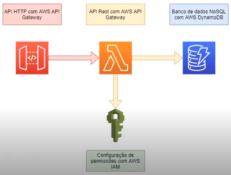

# Conceitos iniciais sobre AWS e arquitetura do projeto prático

### Conceitos base da AWS

* Têm origem no *AWS Well-Architected Framework*

* **5 pilares da AWS**

  * Segurança

  * Eficiência de performance

  * Confiabilidade

  * Excelência operacional

  * Otimização de custos

### Arquitetura

* **Exemplo**

  